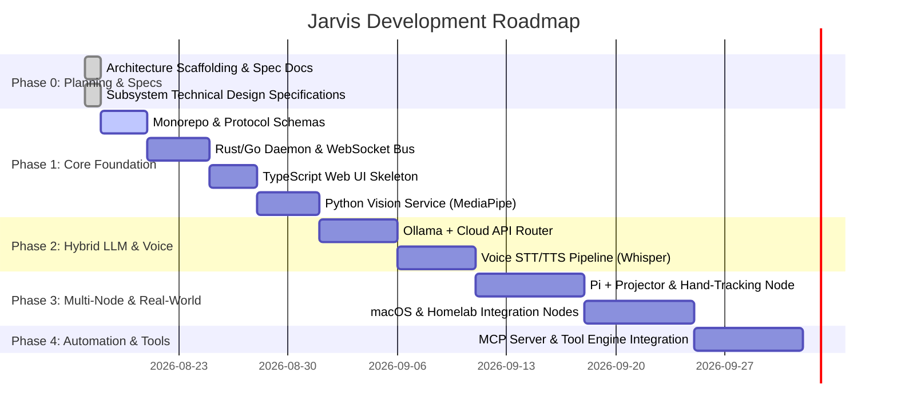

# Jarvis Project Status & Roadmap

> **Current Phase**: Phase 0 — Comprehensive Architecture & Design Complete  
> **Last Updated**: August 17, 2026  
> **Status**: 100% Design & Blueprint Phase Complete — Ready for Phase 1 Monorepo Implementation

---

## 📌 Executive Summary

This project is a dedicated, custom-built personal Jarvis assistant. It moves away from standard chatbot UIs like OpenWebUI into a fully modular, multi-node ambient intelligence system.

It features:
- A high-performance **Rust/Go Core Daemon** for event routing, device control, and system hooks.
- A modern **TypeScript Web Dashboard & Ambient UI** for visual controls, spatial overlays, and status monitoring.
- A **Python Vision & Perception Microservice** for hand-tracking, webcam feeds, and projector interaction (e.g. Pi + camera setup).
- A **Hybrid Model Router** orchestrating fast local LLMs (Ollama) and high-reasoning cloud LLMs (Claude, OpenAI, Gemini).
- A **Multi-Node Device Network** seamlessly bridging PC, Mobile, Raspberry Pi, and Homelab infrastructure.

---

## 📚 Complete Architectural Specs Index

All subsystem architecture specifications are approved and saved under [`docs/superpowers/specs/`](./docs/superpowers/specs/):

1. 🏛️ **[`2026-08-17-jarvis-architecture-design.md`](./docs/superpowers/specs/2026-08-17-jarvis-architecture-design.md)** — Master Monorepo Architecture & IPC Schemas.
2. 🎙️ **[`2026-08-17-voice-and-audio-pipeline.md`](./docs/superpowers/specs/2026-08-17-voice-and-audio-pipeline.md)** — VAD, OpenWakeWord, faster-whisper STT, Kokoro-TTS, multi-node audio routing.
3. 🌐 **[`2026-08-17-multi-node-networking-and-security.md`](./docs/superpowers/specs/2026-08-17-multi-node-networking-and-security.md)** — mDNS discovery, authenticated pairing, WebSocket RPC, permission tiers (`ADMIN`, `SENSOR_PUBLISHER`).
4. 🖐️ **[`2026-08-17-gesture-vocabulary-and-spatial-projection.md`](./docs/superpowers/specs/2026-08-17-gesture-vocabulary-and-spatial-projection.md)** — MediaPipe 3D tracking, 4-point Homography matrix calibration ($H$), gesture map, visual overlays.
5. 🧠 **[`2026-08-17-hybrid-intelligence-router-and-memory.md`](./docs/superpowers/specs/2026-08-17-hybrid-intelligence-router-and-memory.md)** — Intent classification matrix, 3-tier memory engine (RAM, SQLite, Vector RAG), cloud failover.
6. 🚀 **[`2026-08-17-innovative-features-and-future-expansions.md`](./docs/superpowers/specs/2026-08-17-innovative-features-and-future-expansions.md)** — Proactive engine, context modes, spatial audio chimes, Homelab MQTT, MCP server integration.

---

## 🧭 Project Roadmap

---

## 📊 Component Readiness Grid

| Subsystem | Spec Document | Implementation Status | Notes |
| :--- | :--- | :--- | :--- |
| **Agent Guidelines** | [`AGENTS.md`](./AGENTS.md) | ✅ Ready | Rules & context for AI collaborators |
| **Master Arch Spec** | [`specs/2026-08-17-jarvis-architecture-design.md`](./docs/superpowers/specs/2026-08-17-jarvis-architecture-design.md) | ✅ Ready | Overall monorepo blueprint |
| **Voice Pipeline Spec** | [`specs/2026-08-17-voice-and-audio-pipeline.md`](./docs/superpowers/specs/2026-08-17-voice-and-audio-pipeline.md) | ✅ Ready | VAD + Whisper + Kokoro-TTS |
| **WhisperFlow Voice Spec** | [`specs/2026-08-17-low-latency-speculative-voice-streaming.md`](./docs/superpowers/specs/2026-08-17-low-latency-speculative-voice-streaming.md) | ✅ Ready | Two-pass AI speech sanitizer & <350ms streaming |
| **Networking & Security Spec** | [`specs/2026-08-17-multi-node-networking-and-security.md`](./docs/superpowers/specs/2026-08-17-multi-node-networking-and-security.md) | ✅ Ready | mDNS + mTLS + Auth Scopes |
| **SSH Automation Spec** | [`specs/2026-08-17-macos-command-sandbox-permission-guard.md`](./docs/superpowers/specs/2026-08-17-macos-command-sandbox-permission-guard.md) | ✅ Ready | Multi-node SSH key/sshpass admin control bridge |
| **Gestures & Projection Spec** | [`specs/2026-08-17-gesture-vocabulary-and-spatial-projection.md`](./docs/superpowers/specs/2026-08-17-gesture-vocabulary-and-spatial-projection.md) | ✅ Ready | Homography $H$ + MediaPipe |
| **Auto-Homography Spec** | [`specs/2026-08-17-projector-auto-homography-calibration.md`](./docs/superpowers/specs/2026-08-17-projector-auto-homography-calibration.md) | ✅ Ready | OpenCV ArUco 1.5s flash auto-calibration |
| **Router & Memory Spec** | [`specs/2026-08-17-hybrid-intelligence-router-and-memory.md`](./docs/superpowers/specs/2026-08-17-hybrid-intelligence-router-and-memory.md) | ✅ Ready (Updated) | Nemotron 3.5 Lightning MoE + AI self-evaluating cloud escalation |
| **Circuit-Breaker Spec** | [`specs/2026-08-17-offline-circuit-breaker-fallback-router.md`](./docs/superpowers/specs/2026-08-17-offline-circuit-breaker-fallback-router.md) | ✅ Ready | 3-state circuit breaker & zero-downtime offline cascade |
| **Proactive & MCP Spec** | [`specs/2026-08-17-innovative-features-and-future-expansions.md`](./docs/superpowers/specs/2026-08-17-innovative-features-and-future-expansions.md) | ✅ Ready | Ambient modes & spatial sound |
| **Ambient Presence Spec** | [`specs/2026-08-17-ambient-presence-and-proactive-night-mode.md`](./docs/superpowers/specs/2026-08-17-ambient-presence-and-proactive-night-mode.md) | ✅ Ready | 24/7 webcam wall UI tracking & ESP32 MQTT relays |
| **Multimodal Wand Spec** | [`specs/2026-08-17-handheld-multimodal-controller-wand.md`](./docs/superpowers/specs/2026-08-17-handheld-multimodal-controller-wand.md) | ✅ Ready | Seeed XIAO ESP32-S3 macro wand & tactile desk controller |
| **Shared IPC Schemas** | JSON Schema / Protobuf | ⏳ Pending Phase 1 | Schema files in `shared/schemas/` |
| **Core Daemon** | Rust / Go | ⏳ Pending Phase 1 | Daemon skeleton in `daemon/` |
| **Web Dashboard** | TypeScript (Vite/React) | ⏳ Pending Phase 1 | UI skeleton in `web/` |
| **Vision Service** | Python (MediaPipe/OpenCV) | ⏳ Pending Phase 1 | Vision service in `vision/` |

---

## 📝 Key Architecture Decisions Log (ADRs)

- **ADR-001: Bespoke Polyglot Architecture vs. OpenWebUI**
  - *Decision*: Build a custom system instead of extending OpenWebUI.
  - *Rationale*: OpenWebUI is optimized for single-session web chat. Jarvis requires multi-node device routing, local daemon system hooks, low-latency background events, and real-time computer vision streams.

- **ADR-002: Polyglot Microservices (Rust/Go + TS + Python)**
  - *Decision*: Core daemon in Rust or Go; Web UI in TypeScript; Vision in Python.
  - *Rationale*: Leverages the best tool for each domain—Rust/Go for system speed & concurrency, TypeScript for rich UI, Python for ML/MediaPipe ecosystem.

- **ADR-003: Hybrid Local/Cloud LLM Router**
  - *Decision*: Use Ollama locally for fast intent extraction & offline control; bridge to Claude/OpenAI APIs for deep reasoning.
  - *Rationale*: Ensures resilience, low latency for simple actions, and high intelligence when required.

- **ADR-004: mDNS Zero-Config Node Discovery**
  - *Decision*: Use mDNS (`_jarvis-core._tcp.local`) for automatic node discovery across local WiFi.
  - *Rationale*: Eliminates hardcoded IP addresses for Raspberry Pi, Mobile, and secondary PC nodes.

- **ADR-005: 4-Point Homography Perspective Calibration Matrix ($H$)**
  - *Decision*: Use OpenCV homography perspective matrix transformation to map webcam pixel space to projector projection surface.
  - *Rationale*: Allows high-accuracy spatial hand-tracking cursor control on any flat projection surface.

---

## 🏁 Action Plan When Returning Home:
1. Open this workspace in your IDE (`/Users/aryavora/desktop/personal projects/jarvis`).
2. Follow **Phase 1** steps in [`specs/2026-08-17-jarvis-architecture-design.md`](./docs/superpowers/specs/2026-08-17-jarvis-architecture-design.md).
3. Initialize `shared/schemas/`, scaffold `daemon/`, `web/`, and `vision/` skeleton modules.
