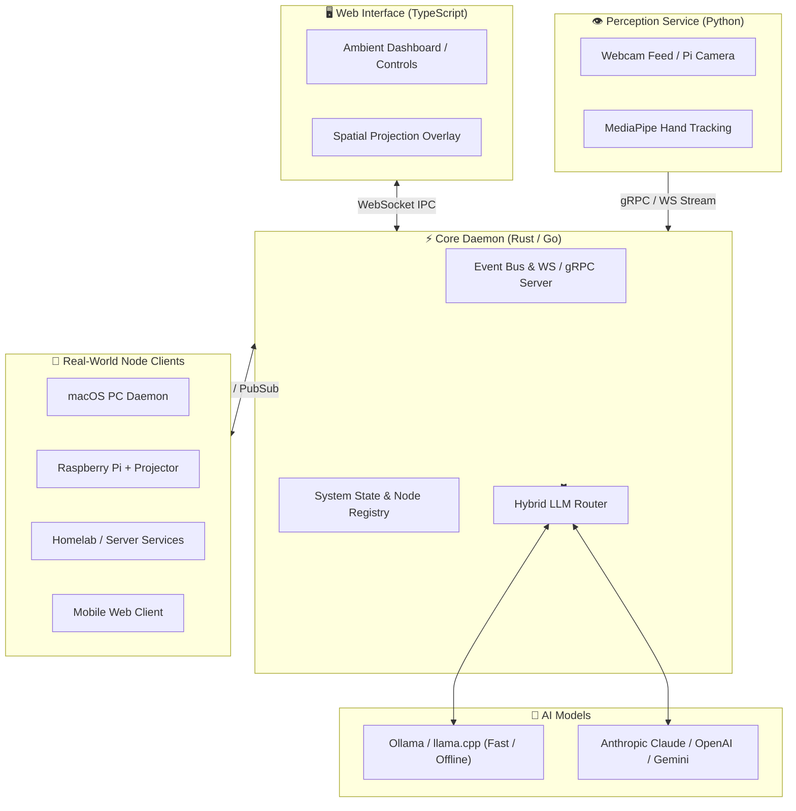

# 🤖 M.I.R.A. — My Interactive Room Assistant

> **Status**: 100% Architecture & Design Phase Complete  
> **Documentation**: [`AGENTS.md`](./AGENTS.md) | [`PROJECT_STATUS.md`](./PROJECT_STATUS.md) | [`Architecture Specs`](./docs/superpowers/specs/)

---

## 🌌 Vision Overview

**M.I.R.A.** (**M**y **I**nteractive **R**oom **A**ssistant) is a custom, multi-node, ambient AI operating system designed for real-world personal control, tactile hardware inspection, and spatial room interaction. 

Unlike stock LLM chat interfaces, M.I.R.A. is an active background ambient system that bridges:
- **Spatial Computer Vision**: Hand tracking & gesture interaction via webcam + Raspberry Pi projector node.
- **Cross-Node Control**: Seamless device execution across macOS PC, Mobile, Raspberry Pi, and Homelab.
- **Hybrid Intelligence**: Fast offline intent parsing via local Ollama models + deep reasoning via Cloud APIs (Claude, OpenAI, Gemini).
- **Ambient UI & Voice**: Real-time ambient dashboard with speech recognition, low-latency voice feedback, and spatial audio cues.

---

## 🏛️ System Architecture



---

## 📚 Technical Design Specifications Index

Detailed architectural blueprints are available under [`docs/superpowers/specs/`](./docs/superpowers/specs/):

- 🏛️ **[`2026-08-17-jarvis-architecture-design.md`](./docs/superpowers/specs/2026-08-17-jarvis-architecture-design.md)** — Master Monorepo Architecture & IPC Schemas.
- 🎙️ **[`2026-08-17-voice-and-audio-pipeline.md`](./docs/superpowers/specs/2026-08-17-voice-and-audio-pipeline.md)** — VAD, OpenWakeWord, faster-whisper STT, Kokoro-TTS, multi-node audio routing.
- 🌐 **[`2026-08-17-multi-node-networking-and-security.md`](./docs/superpowers/specs/2026-08-17-multi-node-networking-and-security.md)** — mDNS discovery, authenticated pairing, WebSocket RPC, permission tiers (`ADMIN`, `SENSOR_PUBLISHER`).
- 🖐️ **[`2026-08-17-gesture-vocabulary-and-spatial-projection.md`](./docs/superpowers/specs/2026-08-17-gesture-vocabulary-and-spatial-projection.md)** — MediaPipe 3D tracking, 4-point Homography matrix calibration ($H$), gesture map, visual overlays.
- 🧠 **[`2026-08-17-hybrid-intelligence-router-and-memory.md`](./docs/superpowers/specs/2026-08-17-hybrid-intelligence-router-and-memory.md)** — Intent classification matrix, 3-tier memory engine (RAM, SQLite, Vector RAG), cloud failover.
- 🚀 **[`2026-08-17-innovative-features-and-future-expansions.md`](./docs/superpowers/specs/2026-08-17-innovative-features-and-future-expansions.md)** — Proactive engine, context modes, spatial audio chimes, Homelab MQTT, MCP server integration.

---

## 📁 Repository Structure

```
jarvis/
├── AGENTS.md                  # Rules, guidelines, and context for AI agents
├── PROJECT_STATUS.md          # Live roadmap, milestone tracker, and ADR log
├── README.md                  # Main entry point & project overview
├── docs/                      # Technical specifications & design docs
│   └── superpowers/specs/     # Architectural specs
├── open-webui/                # Archived/reference OpenWebUI instance
├── daemon/                    # [Phase 1] Rust / Go Core Daemon
├── web/                       # [Phase 1] TypeScript Web Dashboard
├── vision/                    # [Phase 1] Python Vision Microservice
├── nodes/                     # [Phase 2] Node Agent Executors
└── shared/                    # [Phase 1] Shared Protocol Schemas (Protobuf / JSON)
```

---

## 🚀 Getting Started (When You Return Home)

1. **Review Project Status & Specs**:
   - Check [`PROJECT_STATUS.md`](./PROJECT_STATUS.md) for the active roadmap.
   - Read [`docs/superpowers/specs/2026-08-17-jarvis-architecture-design.md`](./docs/superpowers/specs/2026-08-17-jarvis-architecture-design.md) for full implementation details.

2. **Phase 1 Kickoff**:
   - Scaffold the `shared/` IPC types.
   - Run initial core daemon and web dashboard services.
